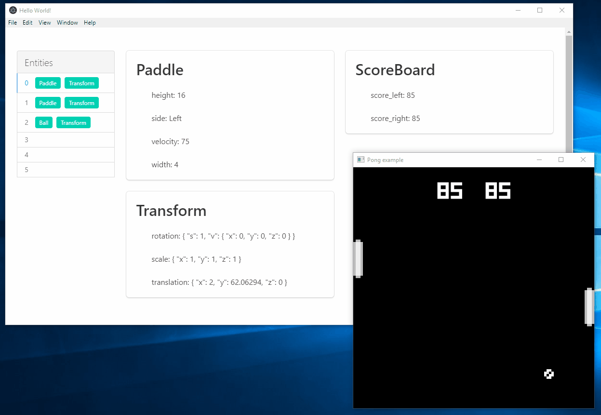

# Amethyst Electron Editor

An experimental editor/visualizer/debugger for the [Amethyst] game engine, built using [Electron].
The goal is to experiment test the viability of using web technologies (specifically HTML5, CSS,
and WebAssembly) to create a powerful, configurable editor that is easily to edit and modify.

## Setup

Use the [amethyst-editor-sync] crate to add support for visualizing your game's state in the editor.

## Motivation and Philosophy

The main goal of this project is to test the viability of web technologies for building the
front-end portion of the editor. While the goal is to avoid JavaScript as much as possible for
performance and robustness reasons, HTML and CSS stand out as widely-used technologies for building
robust, beautiful graphical interfaces. Many developers and designers are already familiar with
using HTML and CSS, which should lower the barrier to entry for anybody who wants to make
contributions to the editor or extend it with custom functionality.

The hope is that by using Rust for application logic and by leveraging a multi-process architecture,
we can overcome the performance concerns that often plague Electron apps.

Additional goals for prototyping:

* Editor robustness in the case of game errors/crashes. This means that it should not be possible
  to cause a hang or an error in the editor from game code.
* Visual customizations through custom CSS themes.
* Extensions/plugins written in JavaScript or Rust (via WebAssembly).
* Embed Amethyst directly in the editor in order to preview assets.

## Status

This project is *highly* experimental. It implements basic functionality for visualizing the
current state of an Amethyst game. It will work with any components and resources that implement
[`Serialize`] (including both user-defined components and ones built into the engine), but
the display is still crude and needs work to display data in a user-friendly way.

Components and resources that should be displayed in the editor also need to be setup manually
using [amethyst-editor-sync] (see [Setup](#Setup) for instructions). The goal is to eventually
provide a more convenient way to setup editor support for all built-in engine types, that way the
user only needs to list their custom types.

The goal is to write all application logic in Rust and then run it either using WebAssembly or as
a native module within the Electron process. The hope is that this will be performant enough to
make Electron a viable alternative to building a native application. Currently the
application logic is written using [Vue.js], which provides a simple JavaScript API for binding
data to HTML templates.

## Roadmap/Wishlist

The following are all things that we would like to add to the project. If you have ideas for how
to make these happen, or would like to make contributions, feel free to open an issue or pull
request!

* Application logic written in Rust, likely with [Yew].
* The ability to edit the state of the world (add/remove entities, add/remove/edit components,
  edit resources).
* The ability to create/edit prefabs.
* Preview assets (meshes, textures, prefabs, etc.) in the editor.
* View systems and information about ordering/dependencies and which entities they currently act on.

[Amethyst]: https://www.amethyst.rs/
[Electron]: https://electronjs.org/
[amethyst-editor-sync]: https://github.com/randomPoison/amethyst-editor-sync
[`Serialize`]: https://docs.rs/serde/1.0.76/serde/trait.Serialize.html
[Yew]: https://github.com/DenisKolodin/yew
[Vue.js]: https://vuejs.org/
